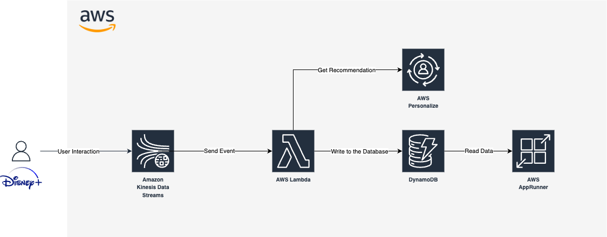
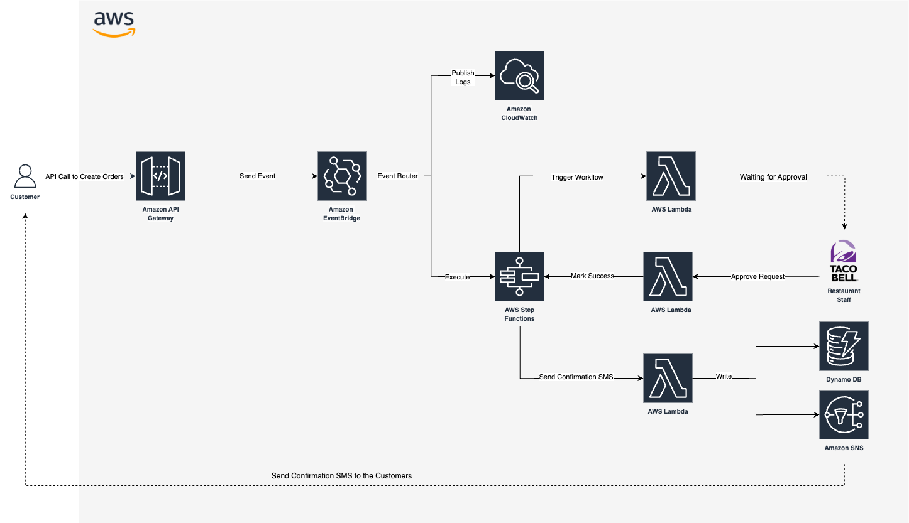

# Serverless Data Processing in AWS
EDEM 2025

- Professor: [Javi Briones](https://github.com/jabrio)

## Data Stream

#### Case description


<br>

Disney+ is looking to analyze real-time user engagement across its streaming platform. The company wants to track how users interact with movies: when they play, pause, or finish content. Using a serverless streaming architecture, Disney+ aims to identify the most popular titles and viewing behaviors. This insight will help improve content recommendations and user experience.

#### Data Architecture


## Setup Requirements

- Clone this **repo**
- For this demo, we will be able to work both **locally** and in the **cloud shell**.
-Go to the **IAM Console**, navigate to the *Users* section, and create a new user. We will use this user's security credentials for our exercises.

- Create a Python environment using Anaconda, selecting **Python 3.10 or 3.11** as the version.

- **Activate** the recently created environment.
```
conda activate <ENVIRONTMENT_NAME>
```

- Install python dependencies by running the following command:

```
cd /01_Code
pip install -r requirements.txt
```

### S3

- Go to the **S3** Console.
- Click **Create bucket**.
- Give your bucket a **name**.
- Click **Create bucket**.
- Edit the bucket you just created.
- Under Permissions, select **Bucket policy**.
- Paste the following code:
```
{
    "Version": "2012-10-17",
    "Id": "PersonalizeS3BucketAccessPolicy",
    "Statement": [
        {
            "Sid": "PersonalizeS3BucketAccessPolicy",
            "Effect": "Allow",
            "Principal": {
                "Service": "personalize.amazonaws.com"
            },
            "Action": [
                "s3:GetObject",
                "s3:ListBucket"
            ],
            "Resource": [
                "arn:aws:s3:::<YOUR_BUCKET_NAME>",
                "arn:aws:s3:::<YOUR_BUCKET_NAME>/*"
            ]
        }
    ]
}
```
- Click **Save**.
- Upload the CSVs files located in folder `01_Code/DataStream/AWS_Personalize/CSV/`

### AWS Personalize.

- Go to the **AWS Personalize** section in the AWS Console.
- Create a **Dataset Group**.
- Follow the steps within the Dataset created in the previous step:
  - Create **datasets** from the CSVs placed in the bucket you just created and **import** them using a job.
  - Set up **training** and **recommendation** resources.
  - Once created, create an **event trackers** for real-time processing.

### Kinesis

- Go to the **Kinesis Data Streams** section in the AWS Console.
- Click **Create data stream**.
- Give your stream a **name** (e.g., DisneyClickstream).
- Under Data stream capacity, select **On-demand** mode.
- Click **Create data stream**.

> *Optional: how to use Kinesis Data Firehose to deliver data to S3*

### IAM: Create a Role for Lambda

- Open the **IAM Console** and go to the **Roles** section.
- Click **Create role**.
- Select **AWS Service** as the trusted entity type.
- From the *Use case* dropdown, choose **Lambda**.
- Click **Next**.
- Attach the following permissions policies:
    - AmazonDynamoDBFullAccess
    - AWSLambdaKinesisExecutionRole
- Click **Next**.
- Provide a **name** for your role.
- Click **Create role**.

### DynamoDB
- Go to the **DynamoDB** Console.
- In the left-hand menu, click **Tables**, then select **Create table**.
- Provide a **name** for your table.
- Set the following keys:
    - `user_id` (Partition key)
    - `timestamp` (Sort key)
- Click **Create table**.

### Lambda

- Navigate to the **Lambda** Console.
- Click **Create function**.
- Enter a *name* for your function.
- Select **Python 3.13** as the runtime.
- Select the **IAM Role** you created earlier.
- Click **Create function**.
- After the function is created, add a **Kinesis trigger**:
    - Choose **Kinesis** as the trigger type.
    - Select the *stream* you created earlier.
    - Click **Add**.
    - If your permissions are properly configured, the trigger will be added successfully.
- Go to the **Code** tab and paste the code provided in folder `01_code/DataStream/LambdaKinesisToDynamoDB.py` of this repository.
- Set the following environment variables:

```
DYNAMO_DB_TABLE_NAME = <YOUR_DYNAMODB_TABLE>
```

### Final Step

> Start the data generator. You should now see the incoming data reflected in DynamoDB.

```
cd /01_Code
python DisneyDataGenerator.py
```

### App Runner

#### ECR: Build and Push Docker Image

- Navigate to the `01_Code` directory where your *Dockerfile* is located.

- Create an ECR repository using the following command:

```
aws ecr create-repository --repository-name <YOUR_REPOSITORY_NAME>
```

- Run the following command to build the Docker image:

```
docker build -t grafana-aws .
```

- Set the following *environment variables*:

```
AWS_ACCOUNT_ID=$(aws sts get-caller-identity --query Account --output text)
AWS_REGION="<YOUR_REGION>"
ECR_REPOSITORY_NAME="<YOUR_REPOSITORY_NAME>"
ECR_URL="$AWS_ACCOUNT_ID.dkr.ecr.$AWS_REGION.amazonaws.com/$ECR_REPOSITORY_NAME"
```

- **Tag** the Docker image:

```
docker tag grafana-aws:latest $ECR_URL:latest
```

- **Log in** to the Docker registry:

```
aws ecr get-login-password --region $AWS_REGION | docker login --username AWS --password-stdin $ECR_URL
```

- **Push** the image to ECR:

```
docker push $ECR_URL:latest
```

#### App Runner: Deploy the Container

- Go to the **App Runner** Console.
- Click **Create App Runner Service**.
- Select **Container registry** as the *Repository type*.
- Choose the **image** you just pushed to ECR.
- In the **Role** dropdown, select the available *AppRunnerECRAccessRole*.
- Click **Next**.
- Provide a *name* for the service.
- Set the port to **3000**.
- Leave the rest of the settings as default and click **Next**.
- Review the configuration and click **Create & Deploy**.
- After deployment, the application will be accessible through the **URL** provided by App Runner.

## Event-Driven 

#### Case description


<br>

Taco Bell aims to enhance its order processing efficiency and scalability by implementing an event-driven architecture. This approach enables real-time management of customer orders, improving operational responsiveness and overall customer satisfaction.

#### Data Architecture


### EventBridge

- Go to the **Amazon EventBridge** Console.
- In the left-hand menu, click on **Event Buses**.
- Each project comes with a default bus, but we'll create a new one. Click **Create event bus**.
- Provide a *name* for the new event bus.
- Click **Create**.
- Go back to the left-hand menu and click on **Rules**. We'll create one rule per branch of our architecture.
- Click **Create rule**.
- Enter a *name* for the rule.
- Select the *event bus* you just created.
- Click **Next**.
- Under *Event pattern*, choose **Other**.
- In the Event pattern **code editor**, paste the following:

```
{
  "source": [{
    "prefix": ""
  }]
}
```

- Click **Next**.
- For the *target*, select **CloudWatch Logs**, and define the name of the log group to be created.
- Click **Next**.
- Review your configuration and click **Create rule**.
- We need to repeat the same procedure for the other branch of the architecture, where we'll create the required **Step Functions** resource. The pattern will be as follows:

```
{
  "source": [{
    "prefix": "com.tacobell.orders"
  }]
}
```

### SNS

- Go to the **Amazon SNS** Console.
- Click **Create topic**, and give it a *name*.
- Select **Standard** as the *topic type*.
- Click **Create topic**.
- Create a **subscription**. Choose **Email** or **SMS** as the protocol (depending on your preference).
- Provide the corresponding endpoint.
- Click **Create subscription**.

### Lambda

The event-driven workflow involves creating one Lambda function for each of the following components:

| Function Name      | Description                           | Required Permission           |
|--------------------|---------------------------------------|-------------------------------|
| LambdaHumanApproval     | Handles human validation              | `lambda:InvokeFunction`       |
| LambdaApprovalHandler   | Triggers Step Functions               | `states:StartExecution`       |
| LambdaToSNS      | Sends data to SNS and DynamoDB        | `sns:Publish`, DynamoDB write |

#### IAM: Create a Role for Lambda

- Open the **IAM Console** and go to the **Roles** section.
- Click **Create role**.
- Select **AWS Service** as the trusted entity type.
- From the *Use case* dropdown, choose **Lambda**.
- Click **Next**.
- Attach the following permissions policies:
    - AmazonSNSFullAccess
    - AWSStepFunctionsFullAccess
- Click **Next**.
- Provide a **name** for your role.
- Click **Create role**.

#### Lambda
- Go to the **AWS Lambda** Console.
- Click **Create function**.
- Enter a *name* for your function (e.g., LambdaHumanApproval, LambdaApprovalHandler, etc.).
- Select **Python 3.13** as the runtime.
- Click **Use an existing role** and choose the role you just created.
- Click **Create function**.
- For each function, navigate to the Code tab and paste the corresponding script from the `01_code/EventDriven/` folder in this repository.
- For the LambdaToSNS function, we’ll need to add this environment variable:

```
SNS_TOPIC_ARN = <YOUR_SNS_TOPIC_ARN>>
```

### Step Functions

- Open the **Step Functions** Console.
- Click **Create State machine**.
- *Name* your State Machine.
- Choose **Standard** as the type.
- Use the *Workflow Studio*.
- Go to the **Code** tab and paste the code provided in this file `/01_Code/EventDriven/StepFunctionsDefinition.json` of this repository.
- Click **Create**.

### API Gateway

#### IAM: Policies & Roles

- A. Policy

    - Go to the **IAM Console**.
    - In the left panel, click on **Policies**.
    - Click **Create policy**.
    - In the service dropdown, select **EventBridge**.
    - Go to the *write* dropdown and check **PutEvents**.
    - Resources: click **Add ARN** and paste the ARN of your Event Bus (created earlier).
    - *Name* your policy.
    - Click **Create policy**.

- B. Role

    - In the IAM console, go to **Roles**.
    - Click **Create role**.
    - Choose **AWS service** as Trusted entity type.
    - In the use case dropdown, select **API Gateway**.
    - Skip attaching policies for now, click **Next**.
    - *Name* your role.
    - Click **Create role**.
    - Once created, go to the role and click **Attach policies**.
    - Attach the policy you just created.

#### Rest API
- Go to the **API Gateway** Console.
- Under *REST API*, click **Build**.
- *Name* your API.
- Click **Create API**.
- Once created, click **Create Resource**.
- Enter Resource Name: `orders`.
- Click **Create Resource**.
- Click **Create Method**.
- From the dropdown, choose **POST**.
- In the POST method setup, select the following configuration:
    - Integration type: **AWS Service**.
    - AWS Region: <YOUR_REGION>
    - AWS Service: **CloudWatchEvents**.
    - HTTP Method: **POST**.
    - Action Type: **PutEvents**.
    - Execution Role: paste the **ARN of the IAM Role** you created earlier.
- Click **Create Method**.
- Click on **Integration Request**.
- Expand **Mapping Templates**.
- Under *Request body passthrough*, choose *When there are no templates defined (recommended)*.
- Click **Add mapping template**.
- Content-Type: application/json.
- In the template editor, paste this:

```
#set($context.requestOverride.header.X-Amz-Target = "AWSEvents.PutEvents")
#set($context.requestOverride.header.Content-Type = "application/x-amz-json-1.1")
{
  "Entries": [
    {
      "Source": "com.tacobell.orders",
      "DetailType": "OrderSubmitted",
      "Detail": "$util.escapeJavaScript($input.body)",
      "EventBusName": "YOUR_EVENT_BUS_NAME"
    }
  ]
}
```
- Click **Save**.
- Click **Deploy API**.
- Create a **new stage** named *dev*.
- Click **Deploy**.

### Final Step

Once the entire E2E setup is complete, you can use the generated endpoint to trigger events that simulate customer interactions with Taco Bell.

## Bibliography & Additional Resources

- Amazon SNS
    - https://docs.aws.amazon.com/sns/latest/dg
 
- Amazon Kinesis
    - https://docs.aws.amazon.com/streams/latest/dev/introduction.html

- Amazon App Runner
    - https://docs.aws.amazon.com/apprunner/latest/dg/architecture.html

- AWS Lambda 
    - https://docs.aws.amazon.com/lambda/latest/dg/welcome.html

- Amazon EventBridge
    - https://docs.aws.amazon.com/eventbridge/latest/userguide/eb-what-is.html

- Amazon StepFunctions
    - https://docs.aws.amazon.com/step-functions/latest/dg/welcome.html