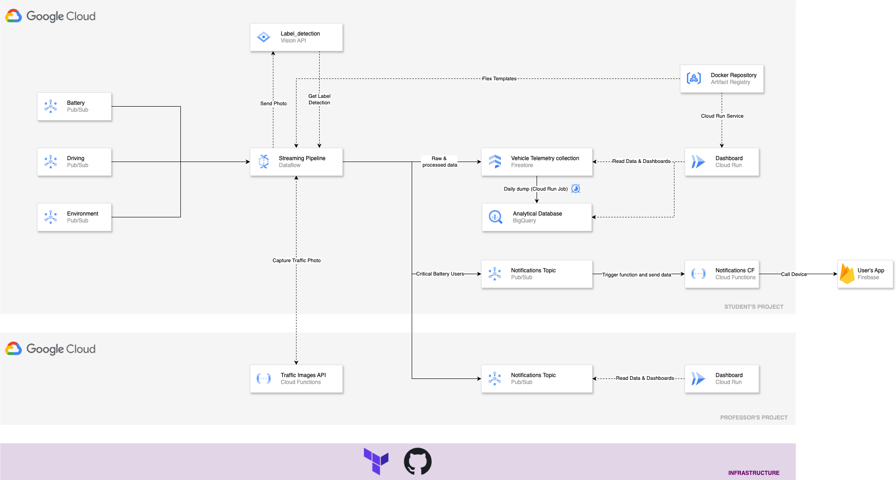

# Serverless Data Processing in Google Cloud
EDEM 2025

- Professor: [Javi Briones](https://github.com/jabrio)

#### Case description


Tesla seeks to enhance user experience by providing accurate real-time information about the remaining range of its electric vehicles. This range depends on multiple factors, such as battery status, driving style, weather conditions, terrain, and traffic status.

The system must process real-time data from the vehicles, assess current conditions, and predict the remaining range based on multiple factors.
In cases of critical range, a notification must be sent to the vehicle, informing the driver of the remaining kilometres. Additionally, telemetry data from the vehicles must be displayed on a dashboard for various stakeholders. 

#### Business challenges

- Inform drivers how far they can travel before needing a charge, considering dynamic factors such as driving style and weather.

- Record predictions and actual conditions to optimize future data analysis, as well as display data that explains the influence of different factors.

- Design an architecture capable of managing data from thousands of vehicles simultaneously.


#### Homework Assignment

- The infrastructure must be managed as a Terraform project, allowing the entire architecture to be deployed seamlessly with a single **terraform apply** command. **[Homework Assignment]**

#### Data Architecture


## Setup Requirements

- [Google Cloud Platform - Free trial](https://console.cloud.google.com/freetrial)
- [Install Cloud SDK](https://cloud.google.com/sdk/docs/install)
- Clone this **repo**
- For this demo, we will be able to work both **locally** and in the **cloud shell**.
- Run this command to authenticate yourself with your GCP account (only locally).

```
    gcloud init
    gcloud auth application-default login
```

- Enable required *Google Cloud APIs* by running the following commands:

```
gcloud services enable dataflow.googleapis.com
gcloud services enable pubsub.googleapis.com
gcloud services enable vision.googleapis.com
gcloud services enable cloudbuild.googleapis.com
gcloud services enable cloudfunctions.googleapis.com
gcloud services enable run.googleapis.com
gcloud services enable logging.googleapis.com
gcloud services enable artifactregistry.googleapis.com
gcloud services enable eventarc.googleapis.com
gcloud services enable firestore.googleapis.com

```

- Create a Python environment using Anaconda, selecting **Python 3.10 or 3.11** as the version.

- **Activate** the recently created environment.
```
conda activate <ENVIRONTMENT_NAME>
```

- Install python dependencies by running the followinw command:

```
cd /02_Code
pip install -r requirements.txt
```

## PubSub

Go to the [Google Pub/Sub console](https://console.cloud.google.com/cloudpubsub) and **create the necessary topics** to simulate the different data sources, ensuring that you check the option to create a default subscription. These topics will be responsible for collecting all data emitted by the different telemetry systems.

## Google Cloud Storage

Now, go to the [Google Cloud Storage](https://console.cloud.google.com/storage) and create a bucket. This bucket must have a **globally unique name** and be **regional** and will serve as storage for temporary and staging files that Dataflow will need during its execution.

## Google Cloud Firestore

Go to the [Google Cloud Firestore Console](https://console.cloud.google.com/firestore) and create a database **(default) in native mode**. This will allow us to store all the data sent by the different systems.

## Google Cloud Artifact Registry

Go to the [Google Cloud Firestore Console](https://console.cloud.google.com/firestore) and create a database **(default) in native mode**. This will allow us to store all the data sent by the different systems.

Go back to the terminal and navigate to the [Cloud Run](02_Code/04_CloudRun) folder. Now, we are going to deploy a Cloud Run service with the Docker image of Grafana.

- Build the Docker Image.

```
docker build -t grafana-cloud-run .
```

- Go to the [Artifact Registry Console](https://console.cloud.google.com/artifacts) and create a repository with the default values.

- Tag the Docker Image.

```
docker tag grafana-cloud-run <REGION_ID>-docker.pkg.dev/<PROJECT_ID>/<ARTIFACT_REPOSITORY>/grafana-cloud-run:<TAG>
```

- Push the image to Artifact Registry.

```
docker push <REGION_ID>-docker.pkg.dev/<PROJECT_ID>/<ARTIFACT_REPOSITORY>/grafana-cloud-run:<TAG>
```

## Google Cloud Run

Go to the [Cloud Run Console](https://console.cloud.google.com/run) and click on **Create Service**:

- Select the Docker image that we just pushed to Artifact Registry.
- Click on **Allow unauthenticated invocation**. 
- Set port **3000** as the container port.
- There is no need to add the environment variables and secrets at this step, as we can do it directly from the Grafana UI.
- Click on **Create**.
- After the Cloud Run service has been deployed, go to the **URL that the service has created**. This URL will take you to the Grafana UI.

    - Click on **Data Sources**.
    - Install the **Firestore** plugin.
    - Enter the required connection details.
    - Once the connection is established, navigate to the Explore or Dashboard tab to create charts that effectively represent business metrics using [FireSQL](https://firebaseopensource.com/projects/jsayol/firesql/).

## Google Cloud Run Functions

Go to the [Cloud Run Function Console](https://console.cloud.google.com/functions) and create a function that triggers **in response to a new message in a messaging queue**. This function will enable sending push notifications to users, informing them of the vehicle's remaining range.

- Environment: 2nd gen.

- Region: <YOUR_REGION_ID>

- Trigger Type: **Cloud Pub/Sub**.

- topic: <YOUR_TOPIC_NAME>

- Click on Next.

- Select **Python 3.12** as Runtime.

- **Deploy** your Function. We will simply simulate the output by handling the push notification process since we do not have a developer app to link our architecture to Firebase.


## Run Dataflow

```
cd /02_Code
```
- From **Local**
```
python edem_dataflow_pipeline.py \
    --project_id <YOUR_PROJECT_ID> \
    --battery_telemetry_subscription <YOUR_BATTERY_PUBSUB_SUBSCRIPTION_NAME> \
    --driving_telemetry_subscription <YOUR_DRIVING_PUBSUB_SUBSCRIPTION_NAME> \
    --environment_telemetry_subscription <YOUR_ENVIRONMENT_PUBSUB_SUBSCRIPTION_NAME> \
    --firestore_collection <YOUR_FIRESTORE_COLLECTION_NAME>
    --output_topic <YOUR_OUTPUT_PUBSUB_TOPIC_NAME> \
    --image_api <API_URL> \
    --system_id <YOUR_USER_NAME>
```

- Run Pipeline in GCP: **Dataflow**
```
python edem_dataflow_pipeline.py \
    --project_id <YOUR_PROJECT_ID> \
    --battery_telemetry_subscription <YOUR_BATTERY_PUBSUB_SUBSCRIPTION_NAME> \
    --driving_telemetry_subscription <YOUR_DRIVING_PUBSUB_SUBSCRIPTION_NAME> \
    --environment_telemetry_subscription <YOUR_ENVIRONMENT_PUBSUB_SUBSCRIPTION_NAME> \
    --firestore_collection <YOUR_FIRESTORE_COLLECTION_NAME>
    --output_topic <YOUR_OUTPUT_PUBSUB_TOPIC_NAME> \
    --image_api <API_URL> \
    --system_id <YOUR_USER_NAME> \
    --runner DataflowRunner \
    --job_name <YOUR_DATAFLOW_JOB> \
    --region <YOUR_REGION_ID> \
    --temp_location gs://<YOUR_BUCKET_NAME>/tmp \
    --staging_location gs://<YOUR_BUCKET_NAME>/stg \
    --requirements_file <YOUR_REQUIREMENTS_FILE>
```

- Run **Generator**

The generator will simulate the various telemetry data captured by the vehicle.

```
cd /02_Code

python edem_data_generator.py \
    --project_id <PROJECT_ID> \
    --telemetry_battery_topic <YOUR_BATTERY_PUBSUB_TOPIC_NAME> \
    --telemetry_driving_topic <YOUR_DRIVING_PUBSUB_TOPIC_NAME> \
    --telemetry_environment_topic <YOUR_ENVIRONMENT_PUBSUB_TOPIC_NAME> \
    --city_name <CITY_NAME> 
```


- Computer Vision Model Output (Label Detection)

```
Results for image:
  Label: Mode of transport, Score: 0.9803327918052673
  Label: Urban area, Score: 0.9568460583686829
  Label: City, Score: 0.9457762241363525
  Label: Metropolitan area, Score: 0.9289360642433167
  Label: Metropolis, Score: 0.8748548030853271
  Label: Thoroughfare, Score: 0.8466328382492065
  Label: Traffic, Score: 0.8180527687072754
  Label: Mixed-use, Score: 0.8130263090133667
  Label: Public transport, Score: 0.7742308974266052
  Label: Travel, Score: 0.7682755589485168
```


## Dataflow Flex Templates

- Go to the [Artifact Registry Console](https://console.cloud.google.com/artifacts) and create a repository with the default values. Alternativaly, it might be created using cli:

```
gcloud artifacts repositories create <YOUR_REPOSITORY_NAME> \
 --repository-format=docker \
 --location=<YOUR_REGION_ID>
```

- Build Dataflow Flex Template

```
gcloud dataflow flex-template build gs://<YOUR_BUCKET_NAME>/<YOUR_TEMPLATE_NAME>.json \
    --image-gcr-path "<YOUR_REGION_ID>-docker.pkg.dev/<YOUR_PROJECT_ID>/<YOUR_REPOSITORY_NAME>/<YOUR_IMAGE_NAME>:latest" \
    --sdk-language "PYTHON" \
    --flex-template-base-image "PYTHON3" \
    --py-path "." \
    --env "FLEX_TEMPLATE_PYTHON_PY_FILE=<YOUR_PATH_TO_THE_PY_FILE>" \
    --env "FLEX_TEMPLATE_PYTHON_REQUIREMENTS_FILE=YOUR_PATH_TO_THE_REQUIREMENTS_FILE"
```

- Run Dataflow Flex Template

```
gcloud dataflow flex-template run "<YOUR_DATAFLOW_JOB_NAME>" \
 --template-file-gcs-location="gs://<YOUR_BUCKET_NAME>/<YOUR_TEMPLATE_NAME>.json" \
 --parameters project_id="<YOUR_PROJECT_ID>",battery_telemetry_subscription="<YOUR_BATTERY_PUBSUB_SUBSCRIPTION_NAME>",driving_telemetry_subscription="<YOUR_DRIVING_PUBSUB_SUBSCRIPTION_NAME>",environment_telemetry_subscription="<YOUR_ENVIRONMENT_PUBSUB_SUBSCRIPTION_NAME>",firestore_collection="<YOUR_FIRESTORE_COLLECTION_NAME>",output_topic="<YOUR_OUTPUT_PUBSUB_TOPIC_NAME>",image_api="<API_URL>",system_id="<YOUR_USER_NAME>" \
 --region=<YOUR_REGION_ID> \
 --max-workers=1
```

## Clean Up

- List your Dataflow pipelines 

```
gcloud dataflow jobs list --region=<YOUR_REGION_ID>
```

- Stop the dataflow job:

```
gcloud dataflow jobs cancel <YOUR_JOB_ID> --region=<YOUR_REGION_ID>
```

- Remove your PubSub Topics and Subscriptions

```
gcloud pubsub topics delete <YOUR_TOPIC_NAME>
gcloud pubsub subscriptions delete <YOUR_SUBSCRIPTION_NAME>
```

- Remove your Artifact Registry Repository

```
gcloud artifacts repositories delete <YOUR_REPOSITORY_NAME> --location=<YOUR_REGION_ID>
```

- Remove your Cloud Function

```
gcloud functions delete <YOUR_CLOUD_FUNCTION_NAME> --region <YOUR_REGION_ID>
```

- Remove your Cloud Run Service

```
gcloud run services delete <YOUR_CLOUR_RUN_SERVICE_NAME> --platform=managed --region=<YOUR_REGION_ID>
```

- Disable the required Google APIs

```
gcloud services disable dataflow.googleapis.com
gcloud services disable pubsub.googleapis.com
gcloud services disable vision.googleapis.com
gcloud services disable cloudbuild.googleapis.com
gcloud services disable cloudfunctions.googleapis.com
gcloud services disable run.googleapis.com
gcloud services disable logging.googleapis.com
gcloud services disable artifactregistry.googleapis.com
gcloud services disable eventarc.googleapis.com
gcloud services disable firestore.googleapis.com

```

## Bibliography & Additional Resources

- Dataflow

    - [Apache Beam Basics](https://beam.apache.org/documentation/programming-guide/)
    
    - [Apache Beam ML](https://beam.apache.org/documentation/ml/about-ml/)
    
    - [Dataflow Flex Templates](https://cloud.google.com/dataflow/docs/guides/templates/using-flex-templates)
    
    - [Dataflow Practical Exercises Guide](https://cloud.google.com/dataflow/docs/guides/)

- IAM
    - https://cloud.google.com/iam/docs/service-accounts-create
    - https://cloud.google.com/iam/docs/understanding-roles
 
- Firestore
    - https://firebase.google.com/docs/firestore/quickstart#python

- Cloud Functions
    - https://cloud.google.com/functions/docs/console-quickstart

- Artifact Registry
    - https://cloud.google.com/artifact-registry/docs/repositories/create-repos

- Cloud Run
    - https://cloud.google.com/run/docs/deploying
    - https://cloud.google.com/sql/docs/postgres/connect-run
